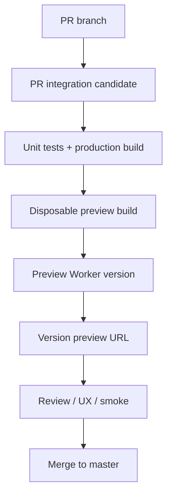
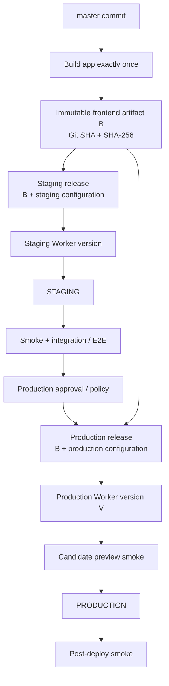
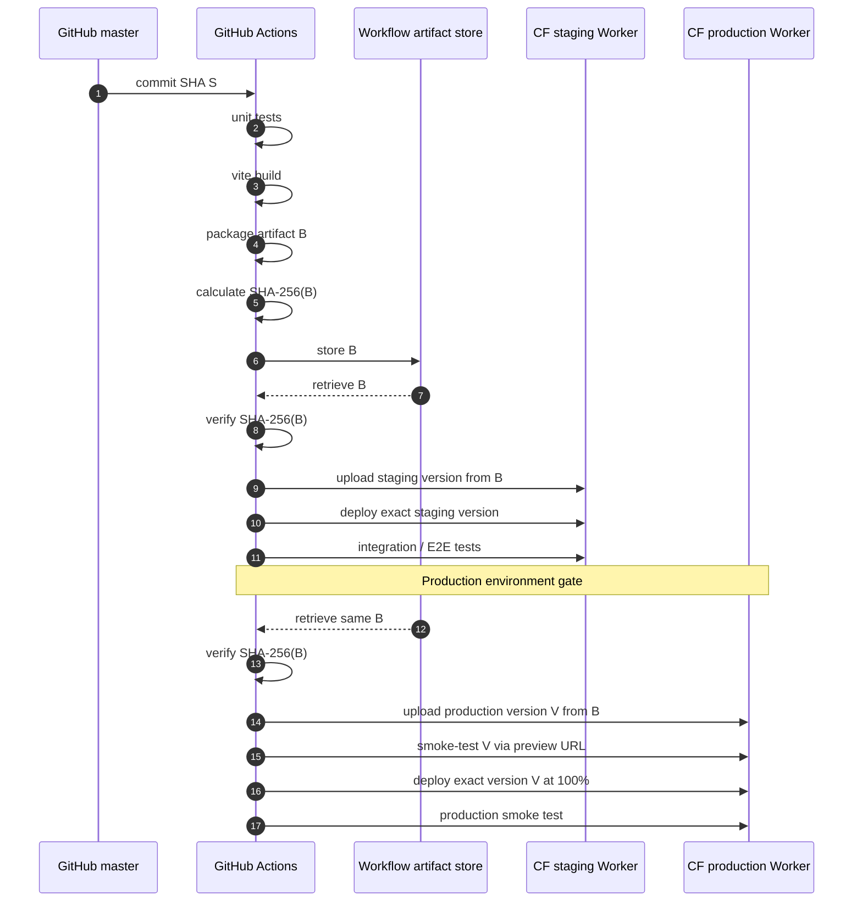

# Frontend delivery architecture

Architecture ID: `app.web`

Status: current

The executable delivery configuration is in:

- [`wrangler.jsonc`](../wrangler.jsonc)
- [`.github/workflows/web-preview.yaml`](../.github/workflows/web-preview.yaml)
- [`.github/workflows/web-release.yaml`](../.github/workflows/web-release.yaml)

## Intent

`app.web` is an independently deployable browser SPA.
`app.web` is hosted using Cloudflare Workers Static Assets.
The CI/CD control plane is GitHub Actions.
The deployment/runtime platform is Cloudflare Workers.

## Release terminology

A **source revision** is an immutable Git commit on branch `master`.

An **application artifact** is the environment-neutral SPA output produced from that source revision.

A **release** combines the application artifact with environment-specific Cloudflare configuration.

A **Worker version** is Cloudflare's immutable representation of a release.

A **deployment** assigns traffic to a Worker version.

These terms are intentionally distinct.

## Pull-request workflow

A PR preview is pre-integration evidence.

It is not a production release candidate and is never promoted to production.

## Main release workflow

## Release sequence

## Delivery invariants

### DELIVERY-INV-01 — Main is the release source

Production releases originate from an immutable commit on `master`.

PR artifacts are never promoted.

### DELIVERY-INV-02 — Build once

For one frontend release candidate, Vite executes exactly once.

The resulting artifact is persisted and reused by subsequent deployment jobs.

### DELIVERY-INV-03 — Artifact identity

Every release artifact is associated with:

- Git commit SHA;
- CI workflow run;
- SHA-256 digest.

The artifact must verify successfully before staging or production release.

### DELIVERY-INV-04 — Environment-neutral browser artifact

Environment-specific values must not be compiled into client assets.

In particular, client code must not use custom `VITE_*` environment variables for staging/production selection.

Prefer same-origin URLs such as `/api`.

Runtime configuration requires an explicit architectural design rather than a second environment-specific Vite build.

### DELIVERY-INV-05 — Separate releases

Staging and production are distinct Cloudflare Workers/releases.

They may have different Cloudflare bindings, routes and runtime configuration, but must contain the same application artifact.

### DELIVERY-INV-06 — Exact version deployment

Production deployment targets a Worker version ID that was already uploaded and successfully smoke-tested.

Do not use `wrangler deploy` in the normal production release path.

### DELIVERY-INV-07 — Deployment serialization

Only one production deployment may execute at a time.

### DELIVERY-INV-08 — Independent deployability

`app.web` is versioned and deployed independently from other deployables.

A shared Git commit does not imply atomic deployment.

### DELIVERY-INV-09 — Backward-compatible runtime contracts

The deployed frontend may communicate with backend versions older or newer than the source revision from which the frontend was built.

Remote contract changes must account for deployment overlap and browser session longevity.

### DELIVERY-INV-10 — Routes are infrastructure

Application releases do not implicitly mutate production domains/routes.

Changes to domains, routes, bindings or other deployment topology require an explicit infrastructure change.

## Rollout policy

The default frontend rollout is 100% traffic after successful staging, candidate smoke tests and the production gate.

Percentage-based frontend rollouts require a separate design review because HTML and hashed assets must retain version affinity.

## Architectural deviation triggers

Implementation must surface a delivery architecture deviation if it requires:

- rebuilding the SPA per environment;
- mutable production assets;
- bypassing staging;
- deploying a Worker version different from the tested candidate;
- introducing server-side code into the frontend Worker;
- changing deployable boundaries;
- changing production routing;
- synchronized deployment with another deployable;
- incompatible remote contract changes;
- percentage-based SPA rollout;
- persistent runtime state in the frontend Worker.

## Configuration ownership

- Delivery intent and invariants live in this document.
- Worker names, environments and asset routing live in `wrangler.jsonc`.
- Build and test commands live in `package.json` and `app-e2e/package.json`.
- GitHub gates, job ordering and concurrency live in `.github/workflows/`.
